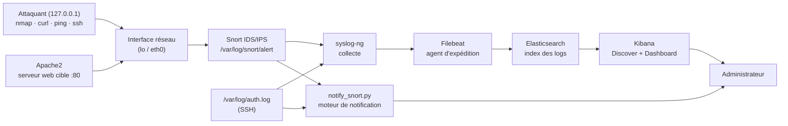

# SIEM — Système de détection d'anomalies et de gestion de logs

Projet du cours **8INF857 – Sécurité informatiqu (SIEM)**
Université du Québec à Chicoutimi (UQAC) · Étudiant : **Earwin Belko Sidibe**

Pipeline SIEM complet : collecte, détection, centralisation, visualisation et
**notification** des événements de sécurité réseau, à l'aide de **Snort (IDS/IPS)**,
**syslog-ng**, **Filebeat**, **Elasticsearch** et **Kibana** (pile ELK).

---

## Architecture



**Flux de données :**
1. **Collecte** — syslog-ng récupère les alertes Snort (`/var/log/snort/alert`) et les logs système (`/var/log/auth.log`).
2. **Détection** — Snort analyse le trafic selon les règles de `rules/local.rules`.
3. **Expédition** — Filebeat transmet les logs à Elasticsearch.
4. **Gestion** — Elasticsearch stocke et indexe les événements.
5. **Visualisation** — Kibana (Discover + dashboard) affiche les anomalies.
6. **Notification** — `notify_snort.py` alerte l'administrateur dès détection.

---

## Structure du dépôt

```
soc-ids-elk/
├── README.md                   # Ce fichier
├── docs/
│   ├── INSTALLATION.md          # Déploiement pas-à-pas (Snort, syslog-ng, ELK, Filebeat)
│   ├── SCENARIOS.md             # Les 5 scénarios : repro + détection + justification
│   ├── VISUALISATION.md         # Data Views et dashboard Kibana
│   └── NOTIFICATION.md          # Moteur d'alerte, format des notifications
├── config/
│   ├── snort-home-net.txt       # Variable HOME_NET utilisée
│   └── syslog-ng-projet_elk.conf# Configuration syslog-ng
├── rules/
│   └── local.rules              # Les 5 règles Snort personnalisées
├── scripts/
│   └── notify_snort.py          # Moteur de notification (journal + e-mail)
├── scenarios/
│   └── run_attacks.sh           # Rejoue les 5 attaques
└── captures/                    # Captures d'écran (à déposer : détections, Kibana, notif)
```

---

## Démarrage rapide

```bash
# 1. Lancer Snort (écoute, écrit les alertes dans un fichier)
sudo snort -A fast -k none -c /etc/snort/snort.conf -i lo -l /var/log/snort

# 2. Lancer le moteur de notification (autre terminal)
sudo python3 scripts/notify_snort.py

# 3. Rejouer les attaques (autre terminal)
bash scenarios/run_attacks.sh

# 4. Visualiser dans Kibana : http://localhost:5601  (Data View suricata/snort)
```

Détails complets dans [`docs/INSTALLATION.md`](docs/INSTALLATION.md).

---

## Les 5 scénarios d'intrusion

| # | Scénario | Règle (SID) | Priorité | Outil |
|---|----------|-------------|----------|-------|
| 1 | Scan de ports (Xmas) | `1000001` | Moyenne | nmap -sX |
| 2 | Force brute SSH | `1000002` + auth.log | Haute | ssh |
| 3 | Scanner web (Nikto) | `1000003` | Critique | curl -A |
| 4 | Anomalie ICMP | `1000004` | Moyenne | ping -s |
| 5 | Injection SQL | `1000005` | Critique | curl |

Description, justification (couche OSI / Cyber Kill Chain) et preuves de détection
dans [`docs/SCENARIOS.md`](docs/SCENARIOS.md).

---

## Composants

| Composant | Rôle | Version |
|-----------|------|---------|
| Snort | IDS/IPS (analyse du trafic) | 2.9.15.1 |
| syslog-ng | Collecte des logs | 3.x |
| Filebeat | Expédition vers Elasticsearch | 8.x |
| Elasticsearch | Stockage / indexation | 8.x |
| Kibana | Visualisation | 8.x |
| Apache2 | Serveur web cible | repo Ubuntu |

Environnement : Ubuntu 22.04 (WSL2).

> ⚠️ Montage de **laboratoire** (sécurité ELK simplifiée, attaques en local sur
> `127.0.0.1`). Ne pas reproduire tel quel en production.
